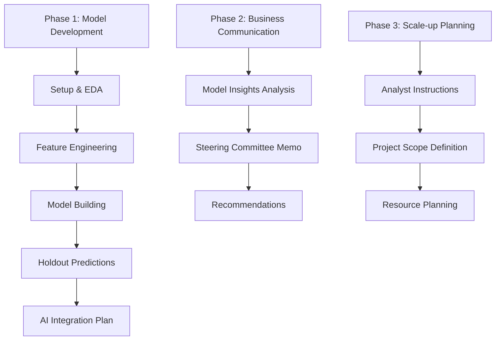

# Part 1.1
- Determine cut-off 

# To check:
- Disticts: Regions, dukas, area, sales_territory

## Feature Eng. Ideas:
- Variables available at the time of loan application are: client_id,Loan_Type,region,duka_name,nominal_contract_value,deposit_amount,contract_start_date,area,sales_territory
- Variables post loan application are: cumulative_amount_paid_start, cumulative_amount_paid
- Variables not found in hold-out data: cumulative_amount_paid. Can use it just for insights.
## Feature Eng. Ideas:
- Regional features: Cummulative count of loans, Cum deposit amount, cum distinct customers, cum nominal contract value,  per region at point of client application, distinct number of dukas in region, distinct sales_territory, distinct areas 
- Reverse geolocate from duka_name to get lat/long and use it to get distance from i) duka to region centroid, ii) duka to urban cities (i.e. Kisumu, Nairobi, Mombasa) 

## Observatins
- Day of the week when someone took the facility affects the cure-rates. Sunday has a below than average cure-rate. So someone taking a loan on a Sunday, affects the cure-rate. Why is Sunday having a lower-level of importance?
# Part 2

## 

Planting Cyle: https://trello.com/b/rA050kNP/planting-cycle Get the planting cycle journey from the trello board and put as a plantuml diagram. Categorize based off inputs etc. Contextualize to smallholder farmers.

Recommendations:
- Farmers TAM -> Tupande TAM -> Offer -> Contracted. Show visual example.
- High-level view: Customers rejected results to a negative experience. i) Rejected (no prior loan, will default) -> Convert to direct inputs at a store. ii) Rejected (prior loan default) -> Default remidation steps -> Direct inputs. Rejcted(false positives) -> Direct inputs iii) Eligible (no contract offer) -> Outbound reach iv) Eligible (has contract offer) -> Drive contract conversion v) Contracted (has contract, Portfolio mix: on_track, outstanding) 
- Make decision (limit allocation) based off: Deposit amount should be: total inputs + CAC - maximum exposure. Rational for CAC included: Free cashflow to continously allow for new acquistion. What about when deposit amount is too high for farmer? Incentivize early deposit (i.e. 1 - 3 months early) and If deposit amount is high, borrower can start early  with fractional deposits 3 months before planting season/inputs. Split the disbursements into pre-defined tranches (based off crop) released based off milestones; this will reduce total gross exposure. Risk: Adverse selection effects of the tranched facility; potential defaulters would be more likely to take the tranche facility. Mitigate by having decision (limit allocation) on the total contract exposure not the max tranche exposure/cummulative exposure. System implementation approach: Book contract total exposure and track drawdown of the tranches at disbursement time.
- Finance benefit of tranching: Increased capital utilization and Return on Risk-Weighted Assets. Example: Current () 
- Increase eligibility: Show us history where other people have trusted you with something(debt), and you fullfiled/completed what you owed...Historical performance from 3rd non-agri lending facilities, prior sales reciepts from off-takers, prior input credit facilities, financial services (SACCO, Mobile Money, MFI, Bank) historical statements.
- incentive (default event > 0) to default = outstanding expsosure - benefit of repayment - cost of default + expected return from crop sales + moral hazard. Benefit of repayment: future incentive to pay back i.e. future loan offered, discounts for repeat borrowers, discounts for cummulative inputs purchased. Have this clearly communicated as a table example below. Expected return from crop sales: (Expected Yield - Post harvest loss) * sales price. Moral Hazard: Borrower has/had the intention to default even prior to taking the facility (closely linked to fraudlent behaviour)  [Have this as a causal diagram showing the relationship and explanations as to negative (-) and positive (+) meanings of the variables]
- Mitigating Moral Hazard - Say am seeking to intentionally defraud the system, repeatedly, how would I go about doing so? (Wear the hat of such persons): i) Fake identity (phone number and stolen id number) ii) Fraudlent historical contracts/transaction history (assuming prior 3rd party loans is an important feature used in the scorecard), iii)   Checks Individual: i) If contract is 1.5x avg. contract value. ii) Group: [Use AI agent to figure out approaches of wanting to defraud Tupande] 
- Default remidation: Exogenous events do happen outside the farmers control. 
- Group Dynamics: Build relationship with group members cause they will be tomorrows potential indiviual borrowers.
- Increase future incentive to pay back: Behavioural rating system. It could be a cummulative points system. Will also serve as a retention mechanism. Points earned from direct purchase from store, loan repayment, early deposit, early repayment, repeat borrower, referral, repayment of facility by referral, crop yield targets etc... Incentives: Examples of incentives: discounts, merchandise,   1) Determine the unit cost of the incentive. 2) Estimate 
- Test and learn budget: Why? Metric to optimize: Increasing the potentially eligible farmers who could be missclassified as ineligible. Randomly select from Reject pool + Eligible pool and lend out. N.B Make sure no selection bias is introduced; so define the selection criteria cause this will be used to build other iterations of the model.

# Part 3

- Scale in 10x factors. We start with 1, next is 10, then 100, then 1000 then full-base of dukas asumming each duka can close 20 contracts, out of 100 outreach. The stages can jumped. Why 1? The manager and analyst directly do this qualitative "feel". They(manager & analyst) directly talk to each of the duka manager (person directly interacting with farmers) & customers, understand the loan cycle journey, how facility was used, fears they had and what they did, individual and group dynamics, reasons as to not converting (especially from the 80 that didn't convert), playbook for duka etc... Orchestating this manually is ok i.e. excel sheet and manual batch scoring with 1 lag-time for contract decisioning. Key activities: Onboarding, 1-on-1 discussions,   . Focus on gathering learnings ASAP. Move to 10 (200) or 100 (2000): Get end-to-end tracking and automation right from interest (when customer got to know about facility) to final repayment. Aspects to learn: CAC costs, BTL mar copy, finance reconciliation, playbook for cluster of dukas. if it's 100 dukas: base-line conversion rate (%) and base-line repayment rate(%), customer persona profile, . Key Activities: Credit decisioning and portfolio management processes,  . Move to 1000: Pick clusters(min. of 200) of Dukas in North, East, West and South quadrants of country. Learnings: With distribution team, optimize supply chain , Key Activities: ATL execution, 1st experiment cohort in test and learn, .    [Create a timeline GANT chart. Stage 1 starts, stage 2 follows in subsequent month]

---
Agentic resources leveraged
- Cline
- SmolAgent - For sense checking and critic of work.
- API Claude 3.7 (thinking) and Claude 3.5 - Text and images