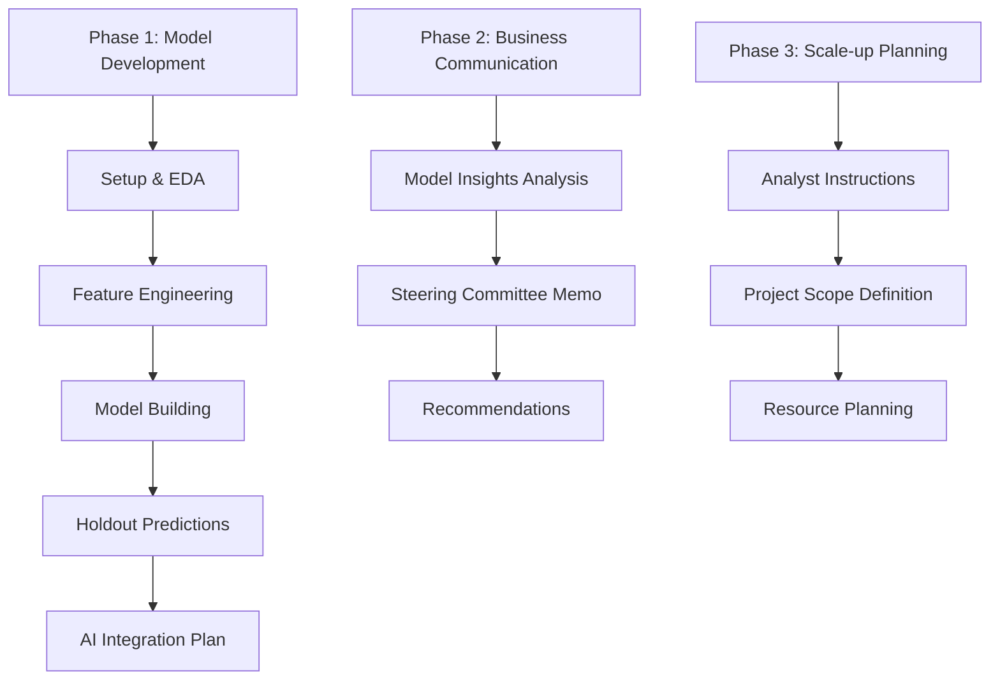

# Part 1.1
- Determine cut-off 

```mermaid
graph TD
    A[Phase 1: Model Development] --> A1[Setup & EDA]
    A1 --> A2[Feature Engineering]
    A2 --> A3[Model Building]
    A3 --> A4[Holdout Predictions]
    A4 --> A5[AI Integration Plan]
    
    B[Phase 2: Business Communication] --> B1[Model Insights Analysis]
    B1 --> B2[Steering Committee Memo]
    B2 --> B3[Recommendations]
    
    C[Phase 3: Scale-up Planning] --> C1[Analyst Instructions]
    C1 --> C2[Project Scope Definition]
    C2 --> C3[Resource Planning]
```