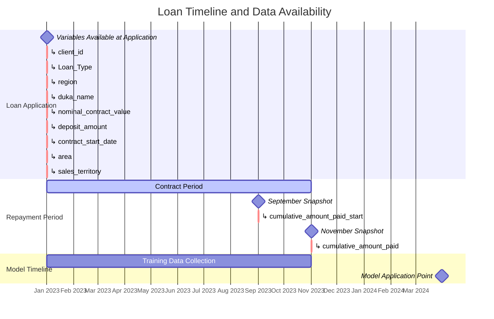

## Day of the week affects cure-rate. Why is Sunday having an effect in the cure-rate? [Add to report]
Day of the week when someone took the facility affects the cure-rates. Sunday has a below than average cure-rate. So someone taking a loan on a Sunday, affects the cure-rate. Why is Sunday having a lower-level of importance?

1. Selection Bias in Sunday Borrowers
Farmers who seek loans on Sundays may have different characteristics than those who apply on weekdays:

They might be more time-constrained during regular business days, possibly due to other commitments or jobs
Sunday applicants might be acting with more urgency/desperation, perhaps responding to an immediate need rather than planned investment
They may have different risk profiles or financial management habits that correlate with both Sunday application and lower repayment probability
2. Operational/Service Quality Differences
Field officers working on Sundays might be different (perhaps less experienced) than weekday staff
Sunday operations might be rushed or have less rigorous verification processes due to weekend staffing
Training or onboarding quality might differ on weekends with less supervisor presence
3. Cultural and Behavioral Factors
Sunday borrowers might associate the loan with personal/family spending rather than agricultural investment (given the day's cultural significance)
Sunday is traditionally seen as a day of rest/leisure in many communities, potentially setting a different psychological framing for financial commitments made on this day
Religious services on Sundays might mean borrowers are making financial decisions in a different mental context
4. Follow-up and Support Differences
Loans disbursed on Sundays might receive different follow-up patterns from field officers
Communication cadence might be affected by the day the relationship began
Initial training/guidance might be abbreviated on weekends
5. Timing Within Agricultural Cycles
Sunday loans might fall at suboptimal points in farming cycles if certain community activities happen on specific days of the week
Market information might be less available on Sundays, leading to poorer investment decisions
To test these hypotheses, you could:

Compare demographic and socioeconomic profiles of Sunday vs. weekday borrowers
Analyze the stated purposes of loans by application day
Compare operational metrics like time-to-decision or documentation completeness across days
Examine whether the effect persists after controlling for loan officer identity
Analyze whether Sunday borrowers receive the same frequency and quality of follow-up

## Feature Engineering and Data Leakage Considerations [Add to Notebook]

### Available Variables and Their Timing

### Feature Engineering Categories

1. **Variables Available at Application Time**
   - These are legitimate features for model training as they're available when making lending decisions
   - Can be used for both training and prediction
   - Examples: loan_type, region, deposit_amount, etc.
   - These represent the information we have at the point of decision-making

2. **Post-Application Variables**
   - **cumulative_amount_paid_start** (September 2023)
     - Cannot be used as a feature because:
       - It represents payment behavior AFTER the loan is disbursed
       - At the point of loan application, we don't know how the client will pay in the future
       - Using this would create data leakage by incorporating future information
       - In real-world application, this data wouldn't exist for new loan applications

   - **cumulative_amount_paid** (November 2023)
     - This is our target variable
     - Represents the final repayment status we're trying to predict
     - Can be used for insights but not as a feature

### Data Leakage Prevention

3. **Why Using cumulative_amount_paid_start Would Create Leakage**
   - Using cumulative_amount_paid_start would be like "peeking into the future"
   - Example of why it's problematic:
     - Training: We use September payment data to predict November status
     - Production: For a new loan application in March 2024, we won't have September 2024 data
     - The model would learn patterns it can't actually use in practice

4. **Correct Approach**
   - Use only variables available at loan application time
   - Focus on historical data and client characteristics
   - Any derived features should use only pre-loan information
   - This ensures the model can be applied to new applications consistently

5. **Observation Window Design**
   - Training data collection: January 2023 - November 2023
   - Features: Only use data available at loan origination
   - Target: November 2023 payment status
   - This structure maintains temporal integrity and prevents leakage
