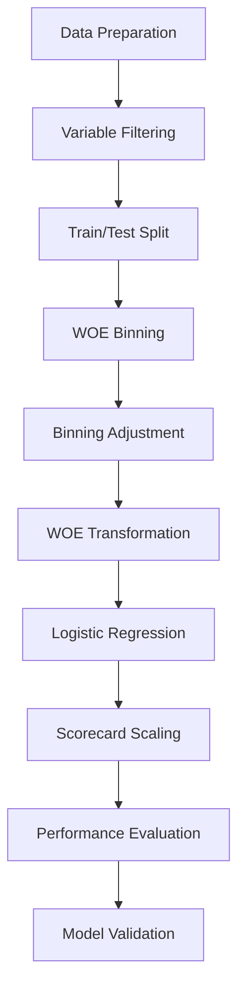
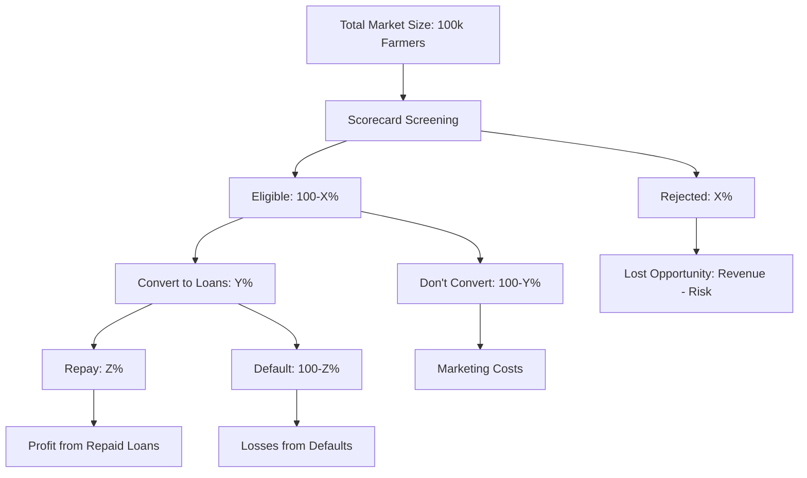

# One Acre Fund Loan Repayment Prediction - Part 1 Approach

## Context & Problem Statement

One Acre Fund provides loans to smallholder farmers who repay these loans in small installments over the growing season. The organization aims to identify farmers at risk of defaulting to enable timely interventions. 

**Key Business Objectives:**
- Achieve a 98% repayment target
- Reduce default rate to 1%
- Expand farmer base by accurately targeting those likely to repay on time

**Technical Task:** Predict the `cumulative_amount_paid` as of November 1, 2023, for each loan.

## Data Understanding

We have data for 36,434 loan instances with 10 input features:
- Client ID (unique identifier)
- Loan Type (Group or Individual)
- Region (geographical area in Kenya)
- Duka Name (store where farmer collects inputs)
- Nominal Contract Value (total value of inputs received)
- Deposit Amount (amount deposited at contract start)
- Contract Start Date
- Area (subdivision of region)
- Sales Territory (subdivision of area)
- Cumulative Amount Paid Start (total amount paid before September 1, 2023)

The target variable is `cumulative_amount_paid` (total amount paid by November 1, 2023).

Based on initial examination of the data, we can see:
- We have both Group Loans and Individual Loans
- Loans span multiple regions in Kenya (Nyanza, Upper Western, Lower Western, etc.)
- There is substantial variation in loan amounts and repayment behavior
- We have historical payment data from contract start to September 1, 2023

## Modeling Approach

While the direct task is to predict `cumulative_amount_paid`, we'll transform this into a binary classification problem to align more directly with the business objective of achieving a 98% repayment target.

### Binary Classification Approach

We'll transform the continuous prediction problem into a classification task:
- **Target Variable Creation**: Define "default" based on a threshold of repayment (e.g., <98% of Nominal Contract Value)
- **Model Output**: Probability of default for each customer
- **Intervention Strategy**: Target high-risk customers for proactive follow-up

### Determining the Optimal Default Threshold

We'll use data-driven approaches to determine the ideal default threshold:

1. **Repayment Distribution Analysis**:
   - Analyze repayment rates by month from contract date (M0, M1, M2, etc.)
   - Look for "elbow points" in the distribution where repayment tends to plateau
   - Examine patterns across different segments (loan types, regions)

2. **Time-Series Repayment Patterns**:
   - Calculate monthly repayment progress (cumulative_amount_paid_start shows September 1 position)
   - Identify when most defaults become evident (early vs. late in the repayment cycle)
   - Analyze seasonal patterns that may affect repayment timing

3. **Business-Oriented Optimization**:
   - Balance false positives (unnecessary interventions) against false negatives (missed defaults)
   - Factor in field team capacity for interventions
   - Consider operational costs of different intervention strategies

### Scorecard Development Using ScoreCardPy

For version 1 of our model implementation, we'll utilize the `scorecardpy` Python package to develop a traditional credit risk scorecard. This approach offers several advantages:

1. **Proven Methodology**: Traditional scorecard development is widely used in credit risk modeling and offers high interpretability
2. **Simplified Workflow**: `scorecardpy` provides comprehensive functions for all stages of the scorecard development process
3. **Robust Feature Processing**: Built-in Weight of Evidence (WOE) binning optimizes feature predictive power while handling non-linear relationships
4. **Integrated Performance Metrics**: KS, ROC, PSI and other traditional credit model metrics are built into the framework
5. **Ready Deployment**: Scoring functions allow seamless transition from model development to application

Our implementation will follow this workflow:

Rather than developing separate region-specific models, we'll:
- Include regional variables in our unified model
- Use proper binning to capture regional patterns
- Evaluate and adjust performance across segments

## Business Optimization & Cost-Benefit Analysis

Our approach will incorporate comprehensive business optimization:

1. **Revenue Impact Assessment**:
   - Quantify "money left on the table" from rejected applications
   - Factor in conversion rates from eligibility to actual loans
   - Calculate expected Return on Risk-Weighted Assets (RORWA)

2. **Intervention Optimization**:
   - Determine optimal threshold for interventions
   - Calculate intervention costs vs. default prevention benefits
   - Factor in capacity constraints for field teams

3. **Long-term Value Considerations**:
   - Customer lifetime value for repeat borrowers
   - Impact of rejections on future customer acquisition costs
   - Regional market penetration effects

## Methodology

### 1. Exploratory Data Analysis
- Distribution of key variables (nominal value, deposit amount, repayment amount)
- Temporal patterns in repayments
- Geographical patterns in repayment behavior
- Relationship between deposit ratio and final repayment
- Loan type performance analysis
- Repayment trajectory analysis over time from contract date

### 2. Feature Engineering & Selection
- **Payment Behavior Metrics**:
  - Deposit to nominal value ratio
  - Repayment rate by September 1st
  - Repayment velocity (amount paid / time since contract start)
  
- **Geographical Aggregations**:
  - Regional/Area/Territory repayment rates
  - Duka performance metrics
  
- **Temporal Features**:
  - Season indicators
  - Days since contract start
  - Contract duration
  
- **Variable Filtering** using scorecardpy:
  - Filter variables via missing rate
  - Information Value (IV) analysis
  - Identical value rate check

### 3. ScoreCardPy Implementation
- **WOE Binning**:
  - Automatic binning for continuous variables
  - Grouping for categorical variables
  - Visual inspection of binning quality using `woebin_plot`
  - Manual bin adjustments as needed using `woebin_adj`

- **Model Training**:
  - Convert features to WOE values using `woebin_ply`
  - Train logistic regression with appropriate regularization
  - Scale coefficients to scorecard points using `scorecard`
  - Apply scorecard to generate credit scores using `scorecard_ply`

- **Performance Evaluation**:
  - KS & ROC curves using `perf_eva`
  - Population Stability Index (PSI) using `perf_psi`
  - Custom business-oriented metrics

### 4. Model Interpretation
- **Scorecard Analysis**:
  - Points contribution by feature and bin
  - Feature importance based on point range
  - Group analysis by score bands

- **Business Impact Assessment**:
  - Score cutoff optimization
  - Expected approval rates and defaults
  - Regional performance variations
  - Cost-benefit analysis at different thresholds

### 5. Holdout Set Predictions
- Generate credit scores for the holdout set using the final scorecard
- Convert scores to default probability estimates
- Classify customers into risk bands
- Identify high-risk customers for intervention
- Calculate expected repayment rates

## Next Steps and Implementation Plan

1. **Set up working environment** with Python and scorecardpy
2. **Data preprocessing** and cleaning
3. **Exploratory analysis** with focus on repayment patterns over time
4. **Default threshold determination** through data-driven analysis
5. **Feature engineering** and variable filtering
6. **WOE binning and scorecard development**
7. **Performance evaluation** and cutoff optimization
8. **Generate predictions** for the holdout set
9. **Compile business recommendations** with implementation strategy
