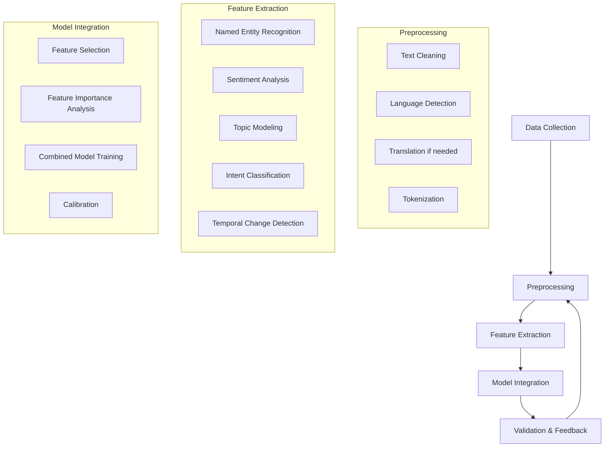

# AI Integration Plan for Loan Repayment Prediction (Part 1.2)

## Context

One Acre Fund is exploring the potential use of text-based field agent reports and voice transcriptions from farmer interactions to enhance their loan repayment prediction model. This document outlines how AI technologies could be leveraged to extract meaningful features from these unstructured data sources to improve repayment predictions.

## Value Proposition

Incorporating text and voice data can provide critical contextual information that numerical data alone cannot capture:

1. **Early Warning Signals**: Farmers may verbally express challenges before they manifest in payment behavior
2. **Contextual Understanding**: Insights into local conditions affecting repayment (weather events, market changes)
3. **Behavioral Indicators**: Sentiment and commitment levels that may predict follow-through
4. **Social Factors**: Community dynamics and support systems that influence repayment

## Data Sources & Collection Strategy

### Field Agent Reports
- **Content**: Structured and unstructured notes from field visits
- **Collection**: Mobile app or form submissions after farmer interactions
- **Frequency**: Regular check-ins (weekly/monthly) plus ad-hoc reports
- **Key Elements**: 
  - Observed farm conditions
  - Farmer statements about challenges
  - Agent assessment of risk factors
  - Actions taken during visit

### Voice Transcriptions
- **Content**: Recordings of farmer interactions with agents or call center
- **Collection**: Recorded calls or in-field conversations with consent
- **Processing**: Speech-to-text conversion with speaker identification
- **Security**: Local language processing with appropriate privacy controls

## AI Processing Pipeline

## Text Processing Techniques

### 1. Preprocessing
- **Language Detection & Translation**: Handle multiple local languages and dialects
- **Tokenization**: Break text into analyzable units
- **Normalization**: Account for spelling variations, especially for local terms
- **Stop Word Removal**: Eliminate common words, customized for agricultural context

### 2. Feature Extraction
- **Named Entity Recognition (NER)**:
  - Identify mentions of crops, inputs, weather events
  - Extract monetary references, dates, and locations
  - Detect mentions of family events (illness, celebrations)

- **Sentiment Analysis**:
  - Overall sentiment score (positive/negative/neutral)
  - Emotion detection (concern, confidence, uncertainty)
  - Commitment level indicators

- **Topic Modeling**:
  - Identify common discussion themes
  - Track topic frequency over time
  - Detect emerging concerns across regions

- **Temporal Pattern Analysis**:
  - Changes in language over time
  - Shifting topics between visits
  - Evolution of sentiment

### 3. Agricultural-Specific NLP Enhancements
- **Custom Entity Recognition**: Train models to recognize:
  - Local crop varieties and farming techniques
  - Region-specific challenges
  - Cultural events affecting finances

- **Agricultural Knowledge Graph**:
  - Connect entities (crops, weather, market prices)
  - Map seasonal dependencies
  - Link regional factors to payment behavior

## Voice Processing Considerations

### 1. Speech-to-Text Pipeline
- **Acoustic Models**: Adapt to local accents and dialects
- **Language Models**: Train on agricultural vocabulary
- **Speaker Diarization**: Distinguish between agent and farmer

### 2. Paralinguistic Feature Extraction
- **Tone Analysis**: Detect stress, confidence, hesitation
- **Speech Rate**: Changes indicating uncertainty or evasion
- **Voice Quality**: Indicators of emotional state

### 3. Multi-Modal Integration
- Combine transcribed content with acoustic features
- Account for cultural differences in expression
- Validate against agent observations

## AI Model Development

### 1. Feature Creation
- **Text-Based Features**:
  - Sentiment scores by topic
  - Entity presence/absence flags
  - Topic distribution vectors
  - Temporal change indicators

- **Voice-Based Features**:
  - Acoustic confidence scores
  - Emotional state indicators
  - Conversation flow metrics

### 2. Integration Methods
- **Feature-Level Fusion**:
  - Add extracted features to existing model
  - Weight features based on predictive power
  - Apply feature selection to prevent overfitting

- **Model-Level Fusion**:
  - Develop separate models for structured and unstructured data
  - Create ensemble combining multiple predictions
  - Use stacked generalization approaches

- **End-to-End Learning**:
  - Deep learning models incorporating text embeddings
  - Multi-modal neural networks for combined processing
  - Transfer learning from pre-trained language models

### 3. Model Selection
- **Interpretable Models** for feature validation:
  - Logistic regression with text features
  - Decision trees incorporating key text indicators
  - Rule-based systems for high-confidence patterns

- **Advanced Models** for maximum performance:
  - BERT/RoBERTa fine-tuned for agricultural domain
  - XGBoost with text-derived features
  - Deep learning for multi-modal inputs

## Implementation Roadmap

### Phase 1: Proof of Concept (3-6 months)
- **Data Collection**: Begin structured recording of field agent notes
- **Basic Processing**: Implement sentiment analysis and topic modeling
- **Simple Integration**: Add 3-5 text-derived features to existing model
- **Validation**: A/B test to measure lift from text features

### Phase 2: Enhanced Features (6-12 months)
- **Advanced NLP**: Custom NER, knowledge graph integration
- **Voice Collection**: Begin selective recording of farmer interactions
- **Expanded Integration**: 10-15 text features in production model
- **Regional Tuning**: Adapt models to regional language differences

### Phase 3: Full Deployment (12-18 months)
- **Comprehensive Collection**: Systematic text and voice data gathering
- **Real-Time Processing**: Dynamic risk updates based on latest interactions
- **Continuous Learning**: Feedback loops to improve language understanding
- **Agent Augmentation**: Provide agents with AI-derived insights

## Ethical Considerations

- **Informed Consent**: Clear processes for obtaining permission for recordings
- **Data Security**: Robust protocols for handling sensitive conversations
- **Bias Mitigation**: Regular audits for regional or demographic biases
- **Explainability**: Transparency in how text data influences decisions

## Expected Business Impact

1. **Improved Prediction Accuracy**:
   - 5-10% increase in default prediction accuracy
   - Earlier identification of at-risk borrowers
   - Reduction in false positives/negatives

2. **Operational Efficiencies**:
   - Better targeting of field agent visits
   - Prioritization of intervention resources
   - Tailored communication strategies

3. **Strategic Insights**:
   - Deeper understanding of default drivers
   - Regional variation in repayment challenges
   - Identification of effective intervention language

## Technical Requirements

- **Computing Infrastructure**:
  - NLP processing capabilities (CPU/GPU)
  - Secure storage for sensitive text/voice data
  - Real-time processing for immediate insights

- **Skilled Personnel**:
  - NLP specialists with agricultural domain knowledge
  - Data engineers for pipeline development
  - Linguists for local language adaptation

- **External Resources**:
  - Pre-trained language models (potentially fine-tuned)
  - Speech-to-text APIs with local language support
  - Annotation tools for training data development

## Measurement Framework

Success will be measured through:

1. **Model Performance Metrics**:
   - Lift in prediction accuracy (AUC, F1-score)
   - Reduction in prediction errors
   - Earlier detection of defaults

2. **Business Outcome Metrics**:
   - Increased repayment rates
   - Cost savings from targeted interventions
   - Expanded lending with maintained risk levels

3. **Learning Feedback Loop**:
   - Continuous tracking of feature importance
   - Regular retraining with new text data
   - Periodic review of feature extraction quality

## Conclusion

Integrating text-based field agent reports and voice transcriptions offers significant potential for enhancing loan repayment predictions. By capturing nuanced information about farmer circumstances, sentiment, and challenges, One Acre Fund can gain deeper insights into repayment risk factors beyond what structured data alone can provide. This more comprehensive view enables earlier intervention, more targeted support, and ultimately improved repayment outcomes.
