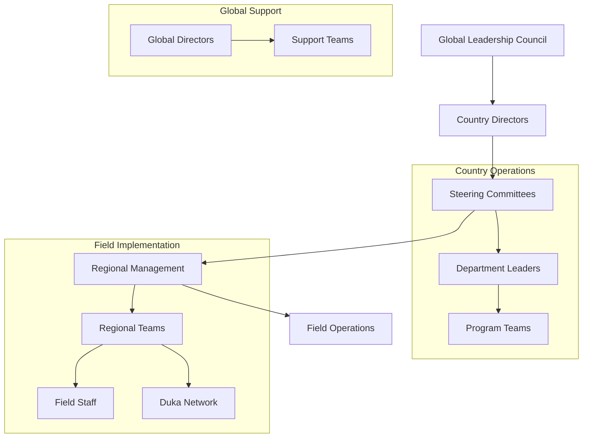
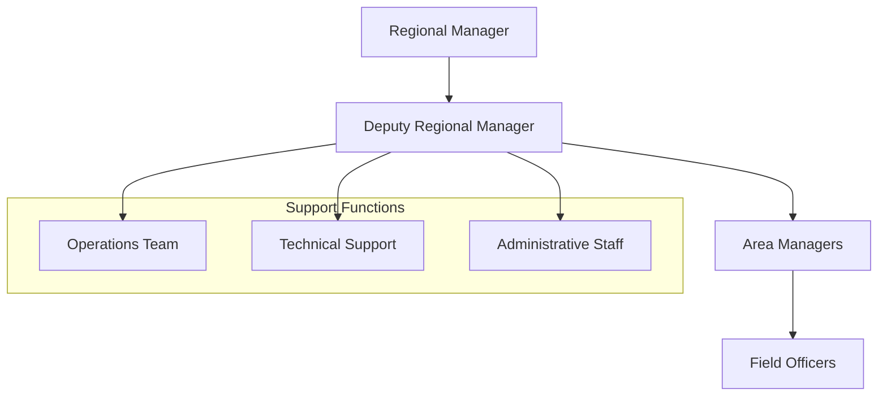
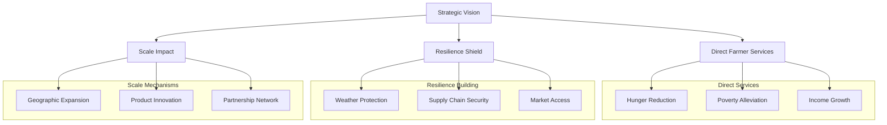

# One Acre Fund - Organizational Structure and Operations

## 1. Leadership Structure

### 1.1 Organizational Hierarchy

### 1.2 Decision Making Structure

| Level | Role | Responsibilities |
|-------|------|-----------------|
| Global | Leadership Council | - Strategic goals - Organizational vision - Cross-country alignment |
| Country | Directors & Steering Committee | - Country strategy - Operational goals - Resource allocation |
| Regional | Management Teams | - Implementation oversight - Performance management - Local adaptation |
| Field | Team Leaders | - Direct farmer engagement - Service delivery - Community relations |

## 2. Operational Model

### 2.1 Service Delivery Framework

| Component | Implementation | Scale |
|-----------|----------------|-------|
| Direct Service | Full-service program | 830,000 farmers |
| Partner Network | Indirect support | 5 million total reach |
| Digital Platform | Technology integration | Growing adoption |
| Field Presence | 95% rural-based staff | Community embedded |

### 2.2 Regional Structure

## 3. Growth and Scale

### 3.1 Historical Growth

| Year | Milestone | Scale |
|------|-----------|-------|
| 2006 | Founded in Kenya | 38 farmers |
| 2022 | Tupande brand launch | Regional expansion |
| 2024 | Current reach | 5 million farmers |
| 2030 | Target | 10 million farmers |

### 3.2 Operational Footprint

| Region | Coverage | Infrastructure |
|--------|----------|---------------|
| Kakamega | Headquarters | Central operations |
| Multiple Regions | 110+ dukas | Retail network |
| Rural Areas | Field offices | Community presence |
| Digital | Online platform | Technology integration |

## 4. Implementation Strategy

### 4.1 Service Delivery Model

| Channel | Purpose | Approach |
|---------|---------|----------|
| Direct Program | Core services | Full-service support |
| Duka Network | Input access | Retail distribution |
| Field Teams | Technical support | Community embedded |
| Digital Platform | Self-service | Technology enabled |

### 4.2 Staff Development

| Level | Focus | Implementation |
|-------|-------|----------------|
| Leadership | Strategic capability | Decentralized authority |
| Management | Operational excellence | Regional autonomy |
| Field Staff | Community engagement | Local recruitment |
| Support Teams | Specialized expertise | Cross-functional support |

## 5. Operational Excellence

### 5.1 Key Performance Areas

| Area | Metrics | Monitoring |
|------|---------|------------|
| Service Delivery | Farmer reach | Regular tracking |
| Financial Performance | Cost efficiency | Monthly review |
| Impact Metrics | Yield improvement | Seasonal assessment |
| Customer Satisfaction | Feedback scores | Continuous monitoring |

### 5.2 Quality Management

| Component | Implementation | Outcome |
|-----------|----------------|---------|
| Staff Training | Regular programs | Skill enhancement |
| Process Standards | Documented procedures | Consistency |
| Performance Monitoring | KPI tracking | Accountability |
| Feedback Systems | Multiple channels | Continuous improvement |

## 6. Sources

| Source | Type | Date | Key Insights |
|--------|------|------|--------------|
| [Leadership Structure](https://oneacrefund.org/about-us/our-organization/leadership) | Primary | 2024 | Organizational design |
| [Tupande Launch](https://oneacrefund.org/articles/introducing-tupande-one-acre-fund) | Article | 2022 | Brand evolution |
| [Job Postings](https://www.escapethecity.org/opportunity/32003-tupande-deputy-regional-manager-at-one-acre-fund) | Primary | 2024 | Role structures |
| [Impact Report](https://oneacrefund.org/our-impact/) | Report | 2024 | Scale metrics |

## 7. Strategic Goals and Future Plans

### 7.1 2026 Strategic Vision

| Component | Target | Strategy |
|-----------|--------|----------|
| Direct Service | 2+ million clients | Core program expansion |
| Total Reach | 6 million families | Direct and indirect services |
| Coverage | 11% of SSA smallholders | Geographic expansion |
| Beneficiaries | 33 million people | Household impact |

### 7.2 Impact Pathways

### 7.3 2030 Goals

| Goal | Target | Current Status |
|------|--------|---------------|
| Farmer Reach | 10 million families | 5 million (2024) |
| Income Generation | $1 billion annually | In progress |
| Tree Planting | 1 billion trees | 75 million by 2025 |
| Market Coverage | 10% of $1/day farmers | Scaling strategy |

### 7.4 Current Challenges

| Challenge | Description | Mitigation Strategy |
|-----------|-------------|-------------------|
| Market Conditions | - Increased fertilizer prices - Supply chain disruptions | - Strategic partnerships - Local sourcing |
| Climate Change | - Erratic weather patterns - Crop vulnerability | - Resilience programs - Diversification |
| Scale Requirements | - Resource constraints - Geographic coverage | - Efficiency focus - Partner network |
| Operational | - Last-mile delivery - Technology adoption | - Duka expansion - Digital integration |

## 8. Innovation and Adaptation

### 8.1 Key Initiatives

| Initiative | Purpose | Implementation |
|------------|---------|----------------|
| Digital Platform | Service accessibility | Mobile app, USSD |
| Product Expansion | Market responsiveness | Diverse input options |
| Environmental Focus | Sustainability | Tree planting program |
| Flexible Financing | Farmer adaptation | Custom payment terms |

### 8.2 Efficiency Measures

| Area | Approach | Expected Impact |
|------|----------|----------------|
| Cost Management | Resource optimization | Improved sustainability |
| Service Delivery | Process streamlining | Enhanced reach |
| Technology | Digital transformation | Operational efficiency |
| Partnership | Strategic collaboration | Extended impact |

## 9. Sources

| Source | Type | Date | Key Insights |
|--------|------|------|--------------|
| [2024-2026 Strategic Plan](https://oneacrefund.org/sites/default/files/2023-11/2024-2026%20Strategic%20Plan%20for%20Dutch%20Website.pdf) | Report | 2023 | Growth targets |
| [Impact Challenge](https://oneacrefund.org/articles/impact-challenge-innovating-double-farmer-profit) | Article | 2024 | Innovation goals |
| [Tupande Launch](https://oneacrefund.org/articles/introducing-tupande-one-acre-fund) | News | 2022 | Brand evolution |
| [Leadership Structure](https://oneacrefund.org/about-us/our-organization/leadership) | Primary | 2024 | Organization design |