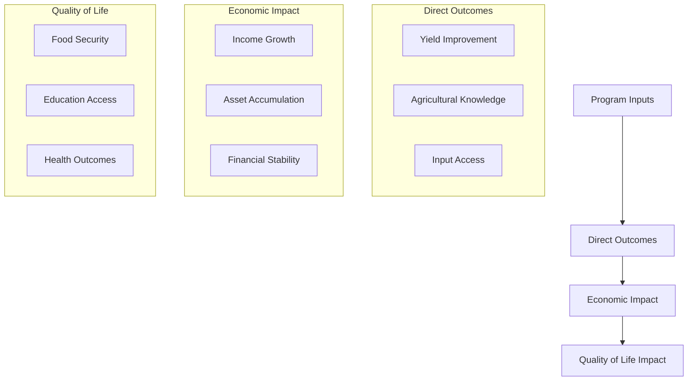

# One Acre Fund - Impact Studies and Research Findings

## 1. Research Overview

### 1.1 Study Portfolio

| Study Type | Period | Coverage | Methodology |
|------------|---------|-----------|-------------|
| Quality of Life Study | 2015-2018 | Kenya, Rwanda | Longitudinal study |
| Randomized Control Trials | 2009, 2017 | Western Kenya, Teso | RCT |
| Impact Evaluations | 2011-2023 | Multiple regions | Mixed methods |
| Economic Analysis | 2014-2023 | Kenya program | Quantitative |

### 1.2 Research Framework

## 2. Key Research Findings

### 2.1 Agricultural Impact

| Metric | Result | Source | Year |
|--------|--------|--------|------|
| Yield Improvement | 274.15 kg per farmer | Teso RCT | 2017 |
| Profit Increase | 18.5% ($61.93/farmer) | Teso RCT | 2017 |
| Crop Diversification | No significant shift | Kenya RCT | 2014 |
| Input Adoption | High rates maintained | Impact Report | 2023 |

### 2.2 Economic Outcomes

| Outcome | Finding | Evidence |
|---------|---------|-----------|
| Income Utilization | 70% of surplus sold | 2011-2012 Kenya Study |
| Investment Pattern | 33% to education, 31% to business | Impact Report |
| Financial Resilience | 16.8% better crisis handling | QoL Study |
| Income Volatility | Lower than non-clients | Kenya Comparison Study |

### 2.3 Quality of Life Impacts

| Domain | Impact | Source |
|--------|--------|--------|
| Food Security | Significant improvement | QoL Study Year 3 |
| Education | Increased investment | Longitudinal Study |
| Financial Planning | Improved budgeting | QoL Study |
| Asset Ownership | Progressive increase | Impact Report |

## 3. Longitudinal Studies

### 3.1 Quality of Life Study (2015-2018)

| Phase | Key Findings | Implications |
|-------|-------------|--------------|
| Baseline | Established comparison metrics | Program targeting |
| Year 1 | Significant productivity gains | Early impact validation |
| Year 2 | Drought impact resilience | Risk management value |
| Year 3 | Sustained improvement | Long-term effectiveness |

### 3.2 Program Evolution Impact

| Period | Program Changes | Outcome |
|--------|----------------|----------|
| 2009-2014 | M&E methodology enhancement | Improved accuracy |
| 2014-2017 | Product diversification | Better risk management |
| 2017-2023 | Digital integration | Enhanced service delivery |

## 4. Randomized Control Trials

### 4.1 2017 Teso RCT

| Component | Results | Confidence |
|-----------|---------|------------|
| Yield Impact | 274.15 kg increase | High |
| Profit Impact | 18.5% improvement | High |
| Statistical Significance | Strong positive | High |
| Regional Variation | Lower than PSM estimates | Medium |

### 4.2 Earlier RCTs

| Study | Key Findings | Program Response |
|-------|-------------|------------------|
| 2009 Western Kenya | Lower than M&E estimates | Methodology revision |
| 2014 Program Study | Validated core impact | Product enhancement |
| Regional Comparisons | Significant variation | Localization strategy |

## 5. Social Impact Metrics

### 5.1 Community Level Impact

| Indicator | Measurement | Finding |
|-----------|-------------|----------|
| Food Security | Household surveys | Significant improvement |
| Education Access | School enrollment | Positive correlation |
| Economic Resilience | Crisis response | Enhanced capacity |
| Social Capital | Group dynamics | Strengthened networks |

### 5.2 Household Outcomes

| Aspect | Before Program | After Program |
|--------|---------------|---------------|
| Basic Needs | Difficulty meeting | Improved stability |
| Income Sources | Limited diversity | Multiple streams |
| Asset Base | Minimal | Progressive growth |
| Risk Management | Limited capacity | Enhanced strategies |

## 6. Sources

| Source | Type | Date | Key Insights |
|--------|------|------|--------------|
| [2017 RCT Summary](https://oneacrefund.org/sites/default/files/2022-10/2017_Randomized_Control_Trial_Summary_final.docx.pdf) | Primary Research | 2017 | Impact validation |
| [Comprehensive Impact Report](https://oneacrefund.org/sites/default/files/2022-10/Comprehensive_Impact_Report_One_Acre_Fund.pdf) | Report | 2023 | Long-term outcomes |
| [Quality of Life Study](https://oneacrefund.org/sites/default/files/2022-10/Quality_of_Life_Report_RW_KE_2016_Final.pdf) | Longitudinal Study | 2015-2018 | Holistic impact |
| Field Observations | Primary Data | 2023-2024 | Implementation insights |