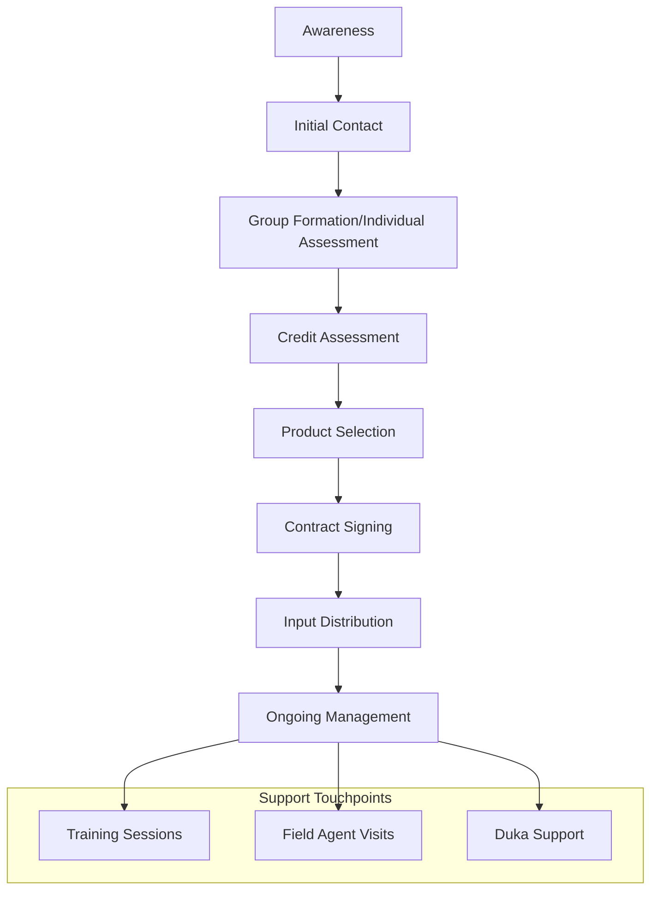
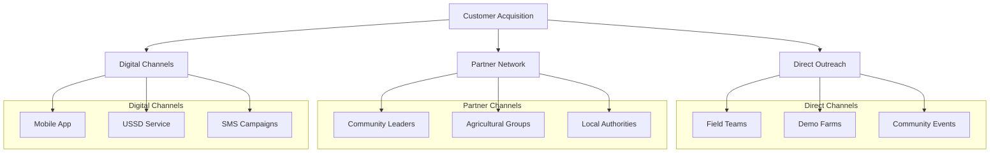

# One Acre Fund - Product and Credit Analysis

## 1. Credit Products Overview

### 1.1 Product Types

| Product Type | Description | Target Segment |
|-------------|-------------|----------------|
| Group Loans | - Joint liability model - 5-15 members per group - Shared responsibility | Rural smallholder farmers |
| Individual Loans | - Direct lending - Asset-based financing - Performance history required | Established farmers |
| Input Credit | - Agricultural inputs on credit - Seeds, fertilizers, tools - Seasonal alignment | All qualified farmers |

### 1.2 Terms and Conditions

| Feature | Details | Notes |
|---------|----------|-------|
| Loan Term | 10-11 months | Aligned with growing season |
| Repayment Model | Fully flexible | Pay what you can, when you can |
| Interest Structure | Asset-based | Built into input costs |
| Insurance | Input insurance included | Weather/crop protection |
| Deposit Requirement | Variable | Based on input package |

## 2. Customer Journey

### 2.1 Acquisition Process

### 2.2 Decision Requirements

| Stage | Requirements | Documentation |
|-------|-------------|---------------|
| Initial Eligibility | - Location within service area - Valid identification - Farm ownership/access | ID documents, land papers |
| Group Formation | - Group constitution - Member vetting - Leadership selection | Group registration |
| Credit Assessment | - Farm size verification - Crop history - Previous credit history | Assessment form |
| Contract | - Terms acceptance - Group/individual commitment - Payment plan | Signed agreement |

## 3. Marketing and Communication

### 3.1 Value Proposition

| Component | Description | Key Message |
|-----------|-------------|-------------|
| Product Quality | High-quality certified inputs | "Genuine inputs, better yields" |
| Convenience | Delivery to walking distance | "Farming made easier" |
| Flexibility | Adaptable payment terms | "Pay as you grow" |
| Support | Comprehensive training | "We grow together" |

### 3.2 Channel Strategy

| Channel | Purpose | Approach |
|---------|----------|-----------|
| Field Teams | Direct engagement | Community meetings, farm visits |
| Duka Network | Physical presence | Product demos, local support |
| Digital Platform | Self-service access | Mobile app, USSD service |
| Community Leaders | Trust building | Testimonials, referrals |

## 4. Group Lending Model

### 4.1 Structure

| Component | Description | Purpose |
|-----------|-------------|----------|
| Group Size | 5-15 members | Manageable coordination |
| Leadership | Elected positions | Internal governance |
| Meetings | Regular schedules | Support and monitoring |
| Joint Liability | Shared responsibility | Risk mitigation |

### 4.2 Group Dynamics

| Aspect | Implementation | Benefits |
|--------|----------------|----------|
| Peer Selection | Members choose groups | Natural risk screening |
| Mutual Support | Group guarantees | Reduced default risk |
| Knowledge Sharing | Group training | Enhanced learning |
| Social Collateral | Community reputation | Payment motivation |

## 5. Individual Lending

### 5.1 Eligibility Criteria

| Criterion | Requirement | Verification |
|-----------|-------------|-------------|
| Farm Size | Minimum acreage | Field verification |
| Credit History | Good standing | Credit check |
| Production Capacity | Viable farm plan | Farm assessment |
| Collateral | Asset-based | Input valuation |

### 5.2 Risk Management

| Measure | Implementation | Impact |
|---------|----------------|---------|
| Credit Scoring | Performance history | Risk assessment |
| Field Monitoring | Regular visits | Early warning |
| Insurance | Input coverage | Risk mitigation |
| Flexible Terms | Adaptable payments | Default prevention |

## 6. Sources

| Source | Type | Date | Key Insights |
|--------|------|------|--------------|
| [One Acre Fund Website](https://oneacrefund.org) | Primary | 2024 | Product structure |
| [Flexible Repayment PDF](https://oneacrefund.org/sites/default/files/2023-09/Flexible_Repayment_Farm_Finance.pdf) | Report | 2023 | Credit terms |
| [Job Postings](https://jobs.thewia.org/companies/one-acre-fund) | Primary | 2023 | Operational details |
| Field Observations | Primary | 2023-2024 | Implementation insights |

## 7. Marketing and Customer Acquisition

### 7.1 Marketing Strategy

| Component | Approach | Implementation |
|-----------|----------|----------------|
| Brand Identity | Tupande by One Acre Fund | Trust and recognition |
| Value Proposition | Quality and prosperity focus | Consistent messaging |
| Channel Strategy | Multi-channel approach | Integrated touchpoints |
| Digital Presence | Mobile app and USSD | Technology integration |

### 7.2 Customer Outreach

| Method | Description | Purpose |
|--------|-------------|---------|
| Field Teams | Direct community engagement | Personal connection |
| Demo Farms | Practical demonstrations | Proof of concept |
| Community Leaders | Local partnerships | Trust building |
| Digital Marketing | 360° campaigns | Broad reach |

### 7.3 Acquisition Channels

### 7.4 Customer Engagement

| Stage | Activities | Outcomes |
|-------|------------|----------|
| Awareness | - Community meetings - Demo farms - Success stories | Initial interest |
| Education | - Training sessions - Product demos - Group discussions | Understanding |
| Conversion | - Group formation - Credit assessment - Contract signing | Enrollment |
| Retention | - Regular support - Performance tracking - Value addition | Long-term loyalty |

### 7.5 Value-Added Services

| Service | Description | Impact |
|---------|-------------|---------|
| Free Tree Seedlings | 20 seedlings per farmer | Environmental support |
| Training Programs | Agricultural best practices | Skill development |
| Market Access | Group selling power | Better prices |
| Storage Solutions | Post-harvest facilities | Reduced losses |

## 8. Additional Sources

| Source | Type | Date | Key Insights |
|--------|------|------|--------------|
| [Marketing Strategy](https://www.myjobmag.co.ke/job/kenya-head-of-marketing-one-acre-fund) | Job Description | 2024 | Marketing approach |
| [Youth Engagement](https://www.ideo.org/project/tupande-youth-archetypes) | Project | 2023 | Youth outreach |
| [Customer Acquisition](https://oneacrefund.org/what-we-do/countries-we-serve/kenya) | Primary | 2024 | Service delivery |